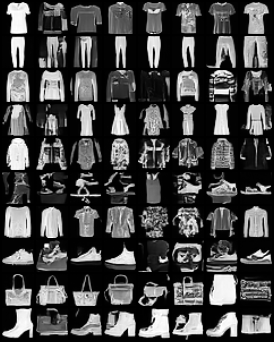

# text-diffusion-fashion-mnist

A **text-conditioned diffusion model, built from scratch in PyTorch** and trained on
Fashion-MNIST. It's a miniature of how Stable Diffusion works: a U-Net learns to reverse a
noising process, conditioned on **frozen CLIP text embeddings**, and generates images from a
caption using **classifier-free guidance**.

I built this to learn generative modeling hands-on — implementing the diffusion math, the
conditional U-Net, and the sampler myself rather than calling a library like `diffusers`. It's
small enough to train on an Apple-Silicon MacBook (MPS), no cloud GPU required.

> **Status:** learning project. The goal was to understand every moving part of a modern
> text-to-image pipeline end-to-end. Results are deliberately modest — Fashion-MNIST at 32×32 —
> but the architecture is the real thing, just scaled down.

<!-- After training, drop a sample grid here:

-->

---

## What it demonstrates

| Area | In this repo |
|------|--------------|
| **PyTorch** | Hand-written U-Net, training loop, EMA, gradient clipping, checkpointing — no high-level trainer |
| **Diffusion models** | Cosine noise schedule, forward process (`q_sample`), DDIM reverse sampler, ε-prediction objective — all implemented in [`src/diffusion.py`](src/diffusion.py) |
| **Multimodal architecture** | Image generation conditioned on **CLIP text embeddings** via FiLM + **cross-attention**, exactly the mechanism Stable Diffusion uses |
| **Guidance** | **Classifier-free guidance** (train with random caption dropout, steer at sample time) |

---

## How it works

### 1. The forward process (adding noise)
Take a clean image `x₀` and add Gaussian noise over `T=1000` steps following a **cosine
schedule**. Thanks to the reparameterization trick, we can jump to any step `t` in one shot:

```
x_t = √(ᾱ_t)·x₀ + √(1−ᾱ_t)·ε ,   ε ~ N(0, I)
```

### 2. The model (predicting the noise)
A **U-Net** `ε_θ(x_t, t, text)` is trained to predict the noise `ε` that was added. The loss is
just `MSE(ε_θ, ε)`. Conditioning enters two ways:
- **FiLM:** the timestep embedding + a pooled CLIP text vector are summed and injected into
  every ResBlock.
- **Cross-attention:** at low resolutions, image features (queries) attend to the CLIP **token
  sequence** (keys/values) — this is how the words in the caption steer the pixels.

### 3. Text conditioning (the multimodal part)
We freeze a pretrained **CLIP text encoder** (`openai/clip-vit-base-patch32`). Fashion-MNIST has a
fixed set of 10 classes, so each becomes a caption like *"a photo of a sneaker, product image on
white background"*, and we **cache** all embeddings once at startup — no CLIP forward pass per
training step, which keeps it fast on MPS.

### 4. Classifier-free guidance (CFG)
During training we randomly replace the caption with an empty string ~15% of the time, so the
model learns both conditional and unconditional denoising. At sample time we combine them:

```
ε = ε_uncond + s·(ε_cond − ε_uncond)
```

`s` (the guidance scale) trades diversity for prompt-adherence. Higher `s` → sharper, more
on-prompt, less varied.

### 5. Sampling (DDIM)
Instead of 1000 reverse steps, we use **DDIM** to sample deterministically in ~50 steps. See
`ddim_sample` in [`src/diffusion.py`](src/diffusion.py).

---

## Project layout

```
config.py              # every hyperparameter, in one dataclass
src/
  data.py              # Fashion-MNIST loader, normalization to [-1, 1]
  text_encoder.py      # frozen CLIP text-embedding cache (the multimodal bridge)
  unet.py              # conditional U-Net: ResBlocks + self- & cross-attention
  diffusion.py         # schedules, forward process, DDIM sampler + CFG
  train.py             # training loop, EMA, checkpoints, preview grids
  sample.py            # generate images from a checkpoint
scripts/
  smoke_test.py        # fast end-to-end wiring check (seconds, no training)
```

---

## Quickstart

> **Apple Silicon note:** use a **native arm64** Python (e.g. Homebrew's
> `/opt/homebrew/bin/python3.11`). A Rosetta/x86_64 Python can't install recent PyTorch and has
> no MPS. Check with `python3 -c "import platform;print(platform.machine())"` → should say `arm64`.

```bash
/opt/homebrew/bin/python3.11 -m venv .venv && source .venv/bin/activate
pip install -r requirements.txt

# 1. Verify everything is wired up (a few seconds, downloads CLIP once):
python -m scripts.smoke_test

# 2. Train (a few hours on an M-series Mac; checkpoints to checkpoints/last.pt,
#    preview grids to samples/ every couple of epochs):
python -m src.train

# 3. Generate images from the trained model:
python -m src.sample --classes all --n 6 --out assets/samples.png
python -m src.sample --classes sneaker,bag,dress --n 8 --guidance 4.0 --out assets/picks.png
```

All knobs (model size, timesteps, guidance, epochs) live in [`config.py`](config.py).

---

## Design choices & what I learned

- **ε-prediction over x₀-prediction** — predicting the noise gives a better-conditioned loss and
  is the standard DDPM parameterization.
- **Cosine schedule over linear** — adds noise more gradually; the linear schedule destroys
  low-resolution image information too fast.
- **EMA weights** — sampling from an exponential moving average of the weights gives visibly
  cleaner images than the raw training weights.
- **Caching CLIP embeddings** — because the label set is fixed, running the text encoder once
  instead of every step cut training time substantially on MPS.
- **Cross-attention placement** — only at 8×8 and 16×16. Attention at 32×32 is expensive and adds
  little for images this small.

## Honest limitations

- The model is conditioned on a **fixed set of 10 captions**, so it's really text-*driven*
  class-conditional generation, not open-vocabulary text-to-image. The cross-attention plumbing
  is the same as an open-vocab model; the dataset is the limit.
- 32×32 grayscale — this is about *understanding the method*, not photorealism.
- No FID/quantitative metric yet (a sensible next step; see below).

## Possible extensions

- Add an **FID** score to quantify sample quality across guidance scales.
- Swap Fashion-MNIST for a small **captioned** dataset (e.g. Oxford Flowers + real captions) to
  make it genuinely open-vocabulary.
- Move to **latent** diffusion (train a tiny VAE first) to scale resolution.
- A small **Gradio** demo for interactive prompting.

---

## References

- Ho et al., *Denoising Diffusion Probabilistic Models* (2020)
- Nichol & Dhariwal, *Improved DDPM* (2021) — cosine schedule
- Song et al., *Denoising Diffusion Implicit Models* (2021) — DDIM
- Ho & Salimans, *Classifier-Free Diffusion Guidance* (2022)
- Rombach et al., *High-Resolution Image Synthesis with Latent Diffusion Models* (2022) — Stable Diffusion
